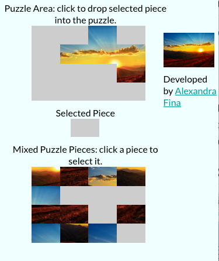
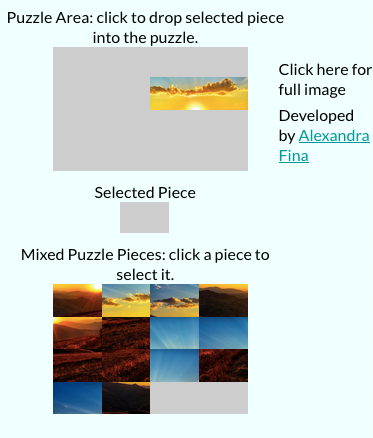
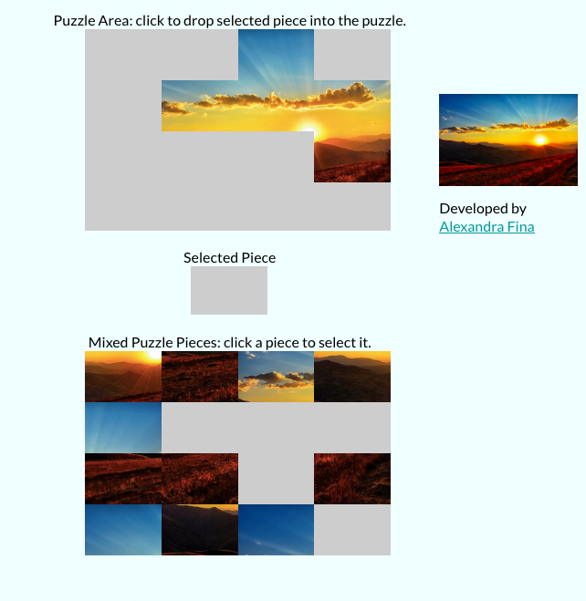
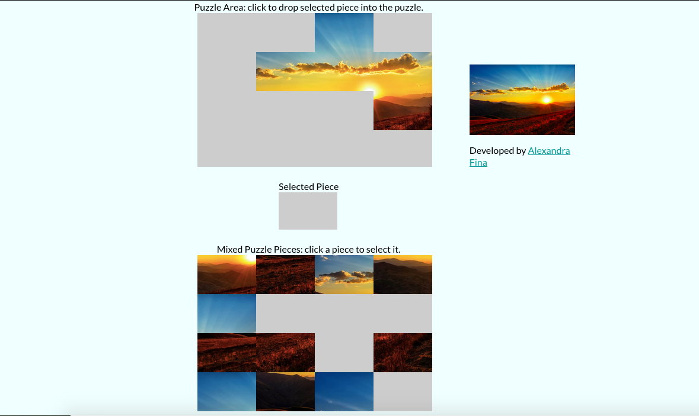
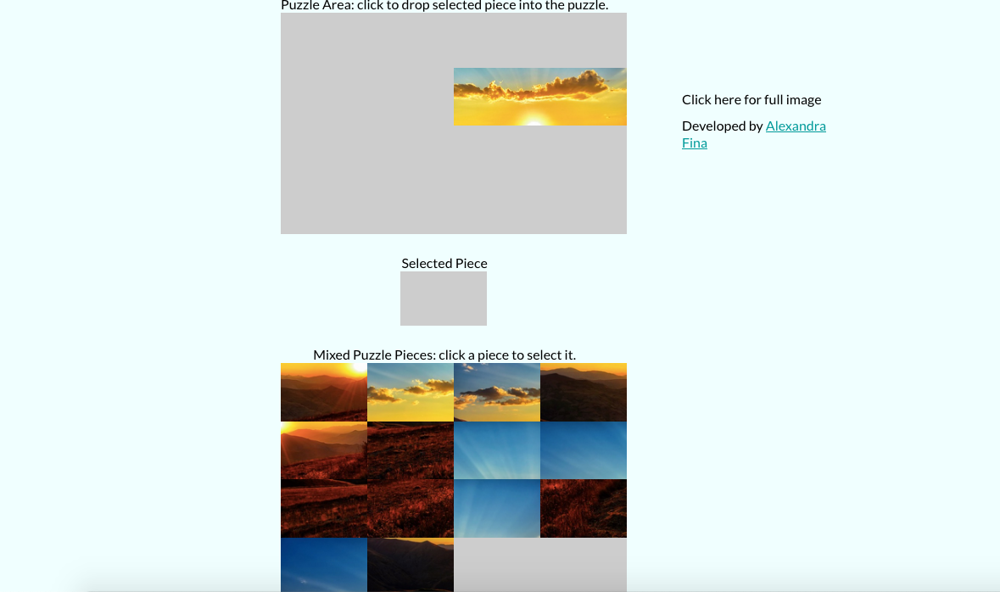

## Puzzle Game (React JS)

## How to play:

```
First click on one of the pieces on the bottom area of the screen (Mixed Puzzle Pieces) and in the middle you will be able to see the current piece that will be used (Selected Piece) and then you click in any of the spaces at the top of the screen (Puzzle Area).
If needed, you can click to reveal the whole picture at the top right of the screen.
Enjoy the game!
```

## How to play using command line

1. On your command line type ``` git clone git@github.com:AlexandraGF/PuzzleGame.git ```
2. Then change the directory by typing ``` cd PuzzleGame ```
3. Run the command ``` npm install ``` and if prompted, ``` npm audit fix ```
4. Run the command ``` npm start ``` and the application will run on ```localhost:3000/```
5. Go in browser and type at the top ```localhost:3000/``` [Firefox recommended]
6. Enjoy the puzzle!

## How to play directly on the internet

1. Click on the link [Puzzle Game](https://puzzlegamereact.herokuapp.com)
2. Enjoy!

## How to run the tests

1. On your command line type ``` git clone git@github.com:AlexandraGF/PuzzleGame.git ```
2. Then change the directory by typing ``` cd PuzzleGame ```
3. Run ``` npm test ``` and node will run the tests on the command line.

## Screenshots from the Game

### Mobile Version 

<p align="center">


</p>

### Tablet Version 



### Desktop Version


